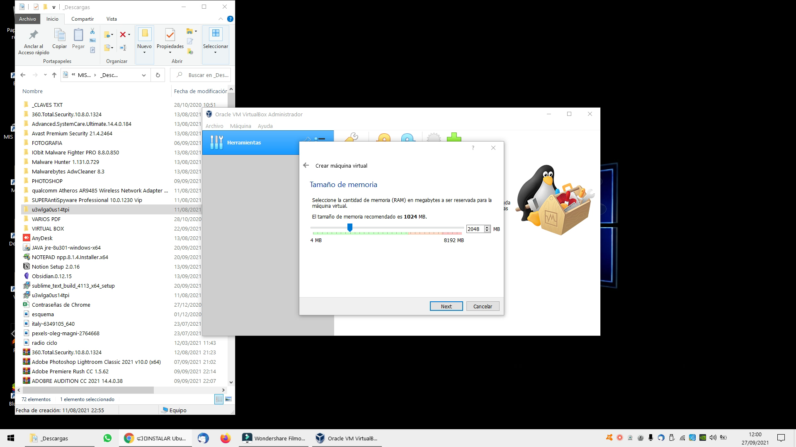
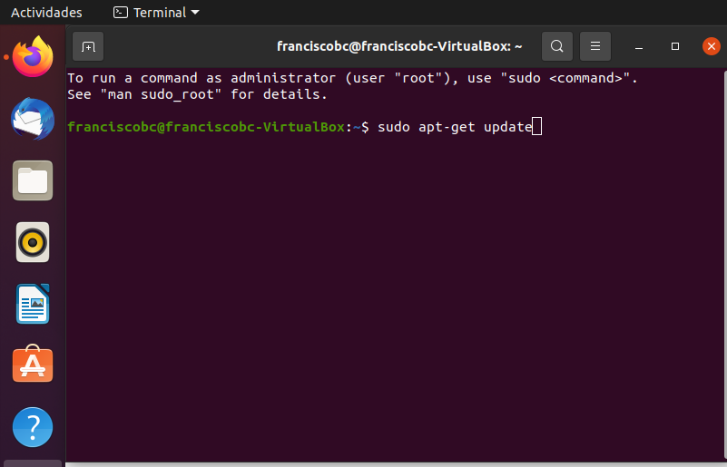
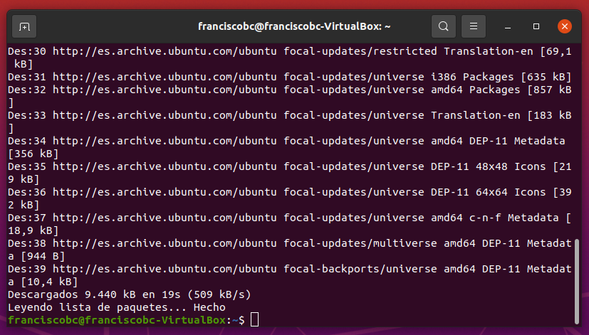
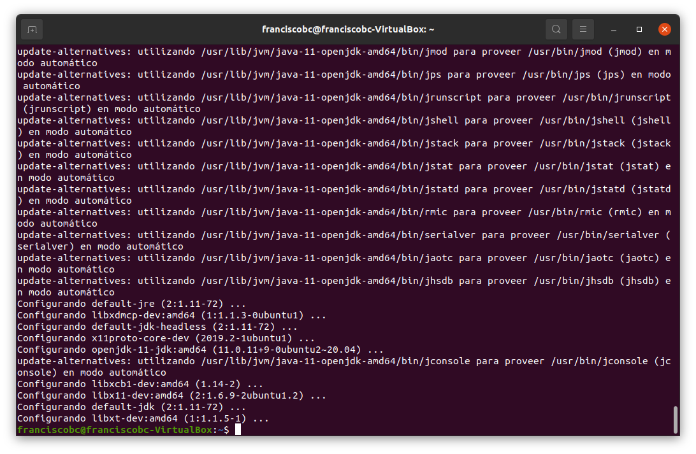
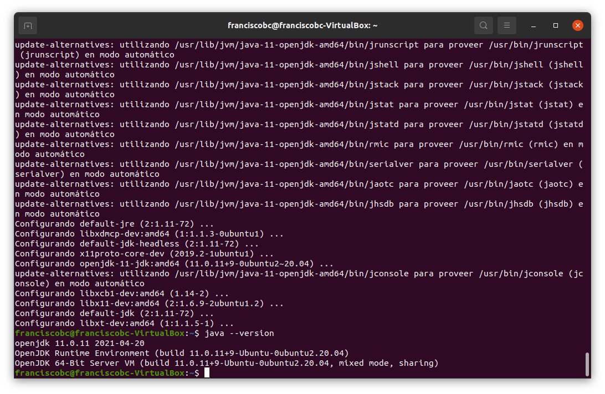
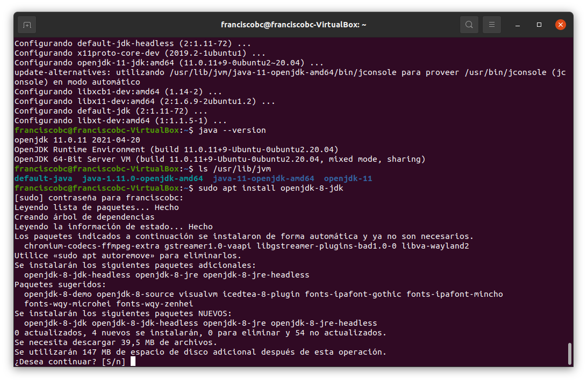
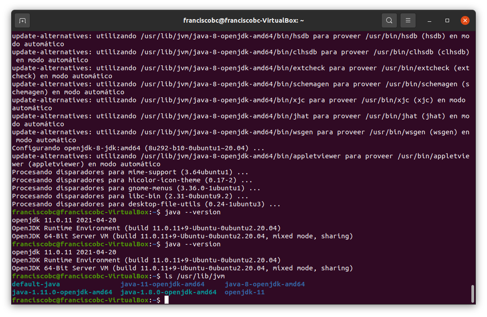
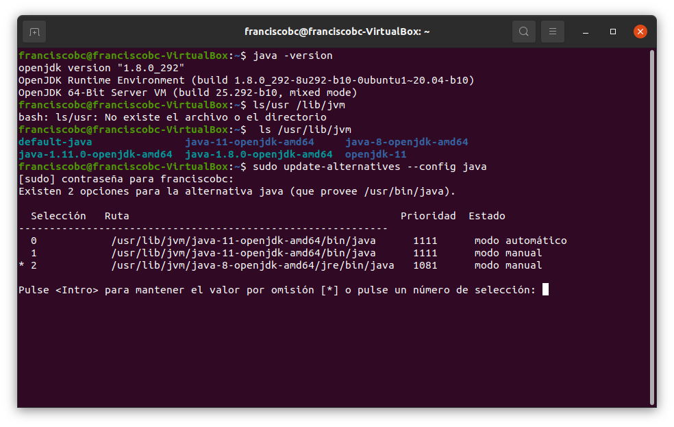

# Instalación de JDK en Linux
 
## Paso1. Instalando máquina virtual y Ubuntu
Para la instalación del OpenJDK, primero instalé el virtualbox en mi ordenador. Luego cree una maquina virtual nueva, guardando en mi disco duro externo que uso para clases.
A continuación instale el sistema operativo Ubuntu.
  
 
Realice los pasos según el video que se sugiere en los apuntes.
 
 
  
 
Finaliza la instalación de Ubuntu dentro de la máquina virtual.
 
## Paso2. Actualización del sistema
Siguiendo los pasos del enlace de github.com indicado en los apuntes.
Lo primero que hice fue actualizar el sistema con los siguientes comandos…

 
  
Luego se instalaba Java con el comando:
Sudo apt-get install default-jdk
 
Al finalizar este comando termina en esta pantalla. 

 
 
Luego se comprobo que el sistema tenía instalado Java, ahora hay que instalar versión 8 ya que se confirma que la versión 8 no se encuentra.

## Paso3. Instalación versión 8
Ahora insertaba el comando: sudo apt install openjdk-8-jdk
Para que instale la versión 8.

 
Vuelvo a comprobar las versiones diferentes instaladas con el comando: ls /usr/lib/jvm  

## Paso4. Selección de la versión
Finaliza con el comando: sudo update-alternatives –config java
Para seleccionar la versión 8.

Con esto finalizo la instalación de OpenJDK.
